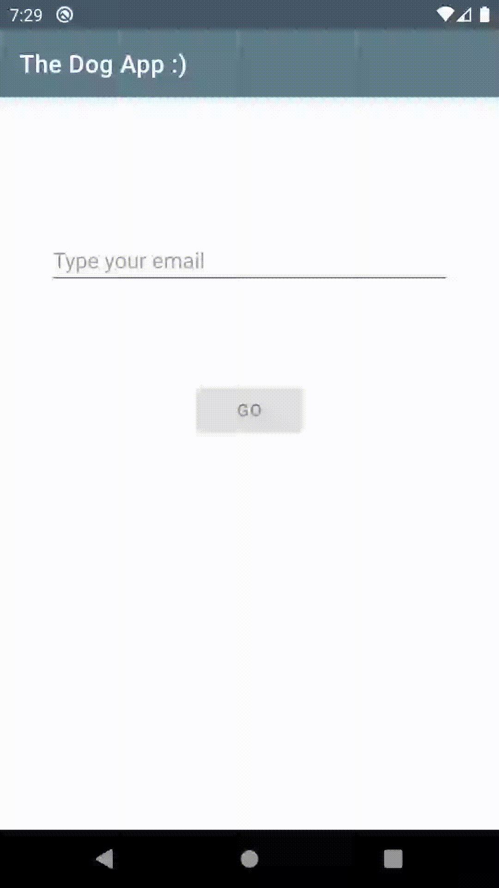

# The Dog App

Para começar, digite um email válido e pressione GO

Uma vez que estiver logado, você verá um Feed como esse (você pode clicar em uma imagem para vê-la expandida e dar zoom como bem quiser)

Você pode ver fotos da sua raça favorita pressionando a tag com o nome da raça

Mas se você ama todas as raças, é só deixar as tags sem selecionar e nós mostraremos todas as raças para você :) 

Se você quiser voltar para o início, é só pressionar o botão de Logout

# Descrição técnica

Arquitetura utilizada foi MVVM, tendo: 

- Comunicação entre `View` e `ViewModel` através de `LiveData`
- Comunicação entre `ViewModel` e `Repository` através de `Rx`, por uma maior disponibilidade de operadores e recursos para operações assíncronas/pesadas
- Injeção de dependências entre todas as camadas

Dependências 1st party (ou quase isso :smile:):

- Room para Banco de Dados
- Retrofit para comunicação de rede
- Libs do pacote Lifecycle do AndroidX para `LiveData` e `ViewModel` e seus utilitários
- Rx Java, Kotlin e Android (versão 3) para a comunicação entre as camadas `ViewModel` e `Repository`
- Mockito Core para criação e manipulação de mocks de teste
- Mockito Kotlin para prover syntax sugars de uso em mocks

Dependências de terceiros para apoio de UI:

- Facebook Shimmer para loading estilizado do Feed
- PhotoView como uma extensão de `AppCompatImageView` com recursos de zoom via touch
- MaterialChipView para as tags estilizadas de raças. Poderia ter feito isso manualmente mas, pelo tempo, foi bem mais conveniente levando em consideração todos os listeners e mudanças de estado já implementados na lib
- Glide para o carregamento, crop e cache em memória das imagens 

Testes:

- Foram desenvolvidos testes para os `ViewModels`, para atestar sua capacidade de receber uma mensagem da `View`, repassar para o `Repository`, traduzir o retorno do `Repository` e mastigar a decisão para a `View`
- Foram desenvolvidos testes para os `Repositories`, para atestar sua capacidade de receber uma mensagem do `ViewModel` e orquestrar tanto o `DataSource` local (Dao) quanto o remoto (Api), em busca da necessidade pedida e retornar uma mensagem razoavelmente lapidada e reativa para esse `ViewModel`
- `ViewModel` e `Repository` foram razoavelmente testados mas teste sempre dá pra melhorar e cobrir cada vez mais cenários :)

Issues mapeadas e decisões:

- Quando li pela primeira vez o conceito do feed e vi que o padrão, caso não fosse informada nenhuma raça de dogo (category), era retornar fotos de Husky, pensei que seria mais bacana se exibisse fotos de todas as raças (mesmo que a princípio a API não provesse isso). 
O que fiz então foi, na camada `Repository`, combinar operadores Rx para concatenar as 4 chamadas possíveis à API, cada uma informando uma raça diferente e embaralhando seu resultado no final. E estava implementada a API com todas as raças que eu queria :grimacing: 
Muitas vezes no dia-a-dia não temos todos os recursos externos disponíveis mas sempre dá para fazer algo do nosso lado para contornar esses detalhes. Para checar essa feature, é só deixar todas as tags de raça desmarcadas na tela do Feed.

- Na leitura do desafio não se diz explicitamente muito sobre o dinamismo das raças de dogos (categories) mas, na minha cabeça, de imediato sei que a melhor decisão arquitetural seria que isso fosse dinamicamente provido por alguma API externa. Como isso não estava disponível na API provida e, em vista do tempo, tomei a decisão de tornar esse dado estático. 
Para resolver isso, na minha concepção, teria que se criar um novo método na camada `Repository` que recuperasse essa informação, replicá-lo em `ViewModel` e então a `View` preencher a área de tags dinamicamente com base na lista de raças provida. O `CardView` que contém essas tags teria que crescer a altura dinamicamente também, especificando um máximo de itens por linha e quebrando quando necessário.

